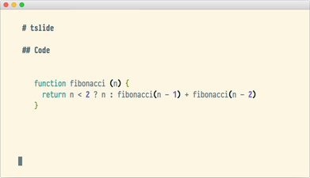

# tslide

Terminal SlideDeck (for backend devs)

---

Controls:
  * Left, Right, or HJKL: change slide.
  * Ctrl-C     : exit

---

# Usage

```
tslide README.markdown
```

each slide is a section of a markdown document,
separated a line with `---` (markdown for horizontal rule `<hr>`)
you will notice that this README.mb is a valid tslide markdown presentation.

---

## crude js syntax highlighting

```md
# tslide

## Code

‘‘‘js
function fibonacci (n) {
  return n < 2 ? n : fibonacci(n - 1) + fibonacci(n - 2)
}
‘‘‘

```
---



This feature is on by default. Disable via `--no-highlight`.

---

## images

[iTerm 2](https://www.iterm2.com) users can 
take advantage of [its inline image feature](https://www.iterm2.com/images.html) and use 
images in your slides.

```md
# tslide

## Images


There's nothing a pizza can't fix.

```
---


This feature is on by default. Disable via `--no-images`.

---

## emoji

Most terminals can print unicode emoji, and others can print system bitmap emoji
like macosx.

```md
# tslide

## Emoji

:sparkles:

Magic!

```
---

## Why?

I initially wrote this 2 hours before a talk I had to give.
since then, I have given many presentations with it,
and received a number of contributions that has made tslide actually pretty good,

---

## thanks to

* [@mmaleki](https://github.com/mmaleki)
* [@yoshuawuyts](https://github.com/yoshuawuyts)
* [@rafaelrinaldi](https://github.com/rafaelrinaldi)
* [@noffle](https://github.com/noffle)
* [@loklaan](https://github.com/loklaan)

for all the pull requests!

---

## cool links

* [xslide](https://github.com/substack/xslide) a tslide compatible presenter in the browser.

---

## License

MIT


